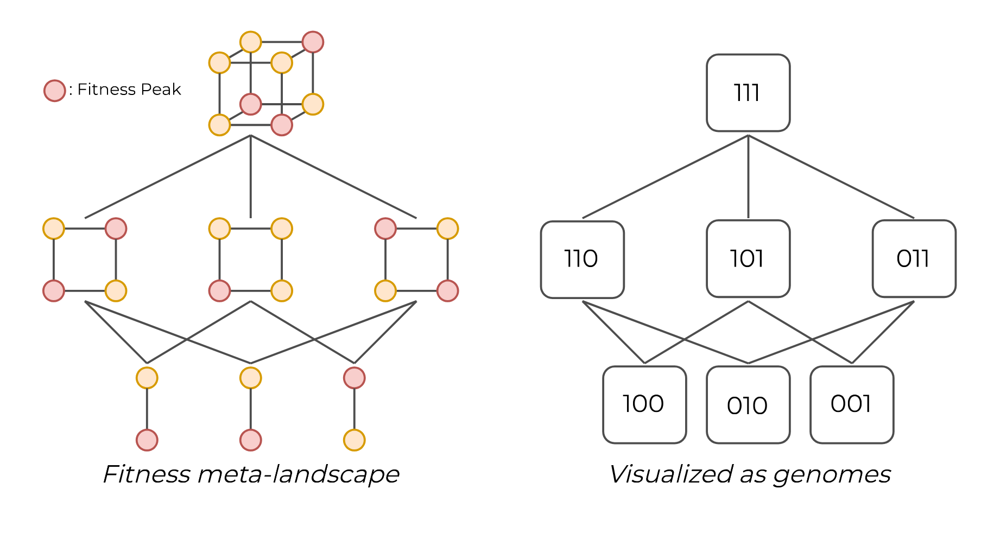
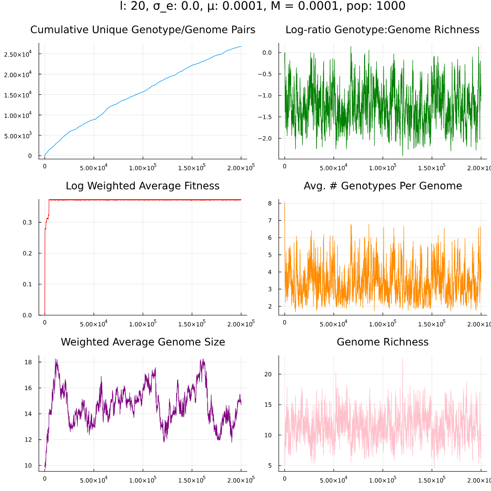

# Introduction

This repository contains code for an expanded Rough Mt. Fuji model that incorporates a mechanism of genome evolution. This serves as the foundational model for my MSc. thesis: <i>"A Computationally Tractable Model for the Evolution of Genome's Size and its Growing Fitness Landscape"</i>. 



The full text of the thesis can be found under `docs` and contains a full description of the model. Briefly, we describe the position of an individual on the fitness meta-landscape through its genome, and its position in any sub-landscape through its genotype, both represented as binary vectors. We then compute fitness as 

$$f_{G,g}=\exp\left(e_{G,g}+\displaystyle\sum_{i=0}^{L}a_i g_i\right)$$ 

and subsequently simulate Wright-Fisher populations adapting on these landscapes. 

# Usage

A single `Utils.jl` file contains all necessary functions to run simulations with this model. For simplicity, this is broken down into three analyses: 

1. Additive landscapes
2. Uncorrelated landscapes
3. Semi-correlated landscapes

Each can be explored through an executable `.jl` script or, (preferably) interactively through the corresponding jupyter notebook. Each simulation requires the initialization of several parameters and RNGs:

Parameter | Description
--- | ---
simulation\_length | Number of generations to run simulation for
total\_population | Number of individuals in the population
$\mu$ | Genotype mutation rate
M | Genome mutation rate
σ_epi | Variance of the distribution of epistatic effects
loci | Maximum genome size
init\_active\_loci | The starting genome size (must be less that maximum size)
max\_init\_genotype\_bits | The number of bits "on" in the initial genotype (must be less than the starting genome size). Keeping this constant produces the same starting genotype regardless of genome size, provided the seed value does not change.

PRNG | Description
--- | ---
rng\_default | PRNG for general processes (currently unused), defaults to `100`
rng\_additive | PRNG for the generation of additive effects, defaults to `100`
rng\_init\_genotype | PRNG for the generation of the initial genotype, defaults to `100`
rng\_init\_genome | PRNG for the generation of the initial genome, defaults to `100`
rng\_mutation | PRNG for the generation of mutants in each generation, defaults to `100`

Thus a typical simulation is run as such:
```
total_population = 1000
σ_epi::Float64 = 0.1
μ = (total_population^-1)/10
M = μ/10
simulation_length = 50000
loci = 100
init_active_loci = 10
max_init_genotype_bits = 1

rng_default, rng_additive, rng_init_genotype, rng_init_genome, rng_mutation = initialize_prngs(genome_seed = 123, mutation_seed = 123)
additive_effects = generate_additive_effects(rng_additive, 0.1, 128)
df_genotypes = simulate(loci, init_active_loci, max_init_genotype_bits, total_population, σ_epi, μ, M, simulation_length, rng_init_genome, rng_init_genotype, rng_default, rng_mutation, additive_effects)
```

And thereafter, the data can be processed into time-series plots with: `generate_plots(df_genotypes, μ, M, additive_effects, σ_epi, save = false)`, with an optional `save` argument, which writes a timestamped plot to `code/outputs/figures`



Additional analyses were performed in R. Corresponding datasets can be found in `code/outputs/data`. 
